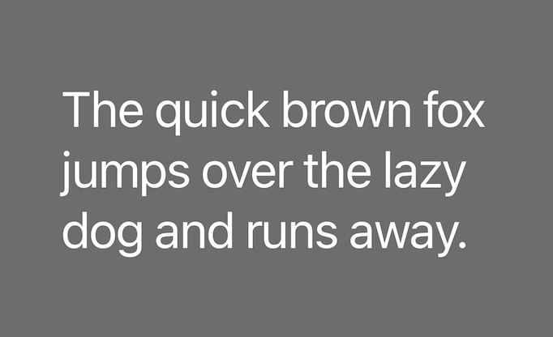

# Change Log

> Never write "Updated `CHANGELOG.md`".

## `1.1.4`

* Added file called `screenshot-9`



* Updated comments color `#6A9955` to `#73A74E`

* Added four more file icons for `favicon.png`, `LICENSE`, `.mp4` and `todo`

* Updated an image in `credits.md`

* Added bunch of new keywords to `package.json`

```txt
assets
    ┗ Screenshot-9.png
themes
    ┗ icons
        ┣ favicon.svg
        ┣ license.svg
        ┣ mp4.svg
        ┗ todo.svg
    ┣ color-theme.json
    ┗ file-icons-theme.json
credits.md
package.json
```

## `1.1.3`

* Added file called `extra-tweaks.md`

* Removed some extra links to `README`

```txt
extra-tweaks.md
README.md
```

## `1.1.2`

* Updated Xcode like blue and terminal color in  `color-theme`

* Added some extra links to `README`

* Renamed `Legal_Disclaimer.txt` to `Legal-Disclaimer.txt`

* Added icon for folder named "Products" to `file-icons-theme.json`

```txt
themes
    ┣ color-theme.json
    ┗  file-icons-theme.json
README.md
Legal-Disclaimer.txt
```

## `1.1.1`

* Added file icon for `Legal_disclaimer`


## `1.1.0`

* Updated `package.json`, `credits.md` and `CHANGLOG.md`

* Added `Legel_Disclaimer.txt`

```txt
* folder
    ┣ CHANGELOG.md
    ┣ credits.md
    ┣ Legel_Disclaimer.txt
    ┗ README.md
```

---

## `1.0.2`

* Finally, the first release is here + added some file icon + fixed some bugs


---

## `0.6.2/ 0.6.3`

* Updated readme and changelog

---

## `0.6.1`

* Updated changelog + deleted unused readme

```txt
vsc-extension-quickstart.md
```

---

## `0.6.0`

* Added bunch of folder icons


---

## `0.5.0`

* Added [credits page](credits.md)

```txt
credits.md
```

---

## `0.4.1`

* Added screen shot and font for product theme

```txt
themes
    ┗ fonts
        ┗ SF-Pro.ttf
```

---

## `0.4.0`

* Added product icon theme

---

## `0.3.1`

* Updated readme file

---

## `0.3.0`

* Added file icon theme
