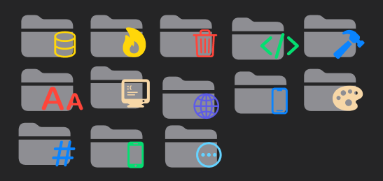

# Change Log

## `1.1.1`


* Added file icon for `Legal_disclaimer`

## `1.1.0`

* Updated `package.json`, `credits.md` and `CHANGLOG.md`

* Added `Legel_Disclaimer.txt`

```txt
* folder
    ┣ CHANGELOG.md
    ┣ credits.md
    ┣ Legel_Disclaimer.txt
    ┗ README.md
```

---

## `1.0.2`

* Finally, the first release is here + added some file icon + fixed some bugs


---

## `0.6.2/ 0.6.3`

* Updated readme and changelog

---

## `0.6.1`

* Updated changelog + deleted unused readme

```txt
vsc-extension-quickstart.md
```

---

## `0.6.0`

* Added bunch of folder icons



---

## `0.5.0`

* Added [credits page](credits.md)

```txt
credits.md
```

---

## `0.4.1`

* Added screen shot and font for product theme

```txt
themes
    ┗ fonts
        ┗ SF-Pro.ttf
```

---

## `0.4.0`

* Added product icon theme

---

## `0.3.1`

* Updated readme file

---

## `0.3.0`

* Added file icon theme
