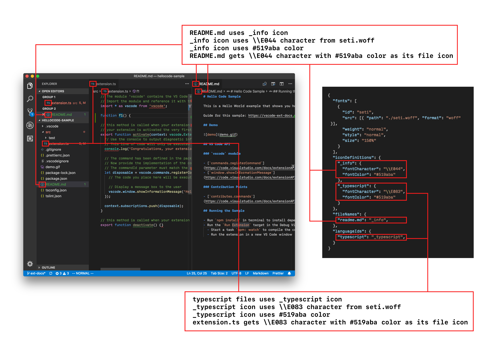
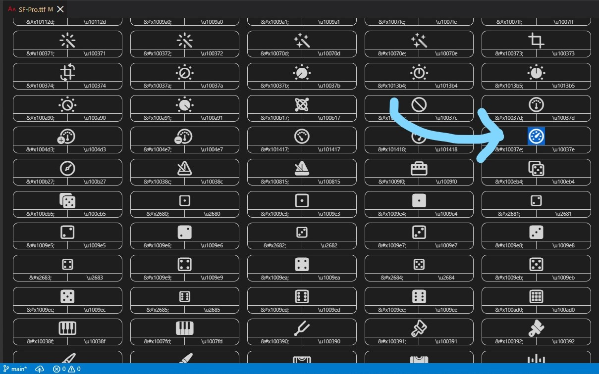
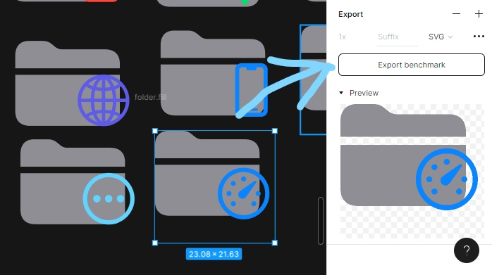
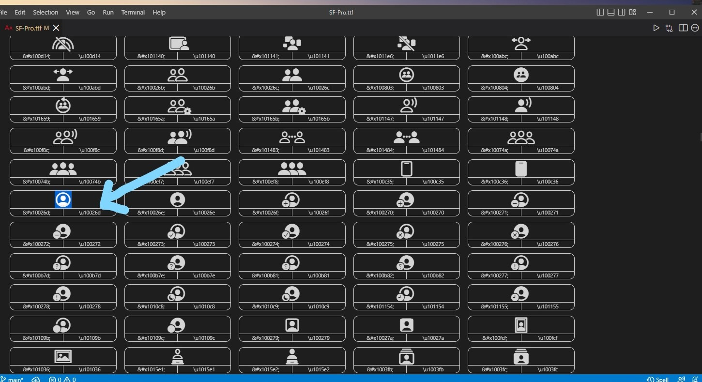

# Contributing Guide

---

## Table of Content

- [Guide](#Contributing-Guide)

  - [Setting Up env.](#setting-up-env)

- [Different types of theme](#different-types-of-theme)

- [Adding new File/ Folder icon](#adding-new-file-folder-icon)

- [Adding Product Icon](#adding-product-icon)

---

### Setting Up env.

* Download [the Source Code](https://github.com/Hetp05/xcode-theme-for-vscode.git/) of this extension

* Font [SF Pro](https://developers.apple.com/fonts/)/ [SF Pro Display Light](https://developers.apple.com/fonts/) by Apple.

* [VS Code extension](https://marketplace.visualstudio.com/items?itemName=stxr.iconfont-preview) for viewing `.ttf` font files

* [Color Highlight extension](https://marketplace.visualstudio.com/items?itemName=naumovs.color-highlight) for viewing highlight of web colors in your editor


* [Figma](https://www.figma.com/) for icon designing

---

## Different types of theme



[Learn more](https://code.visualstudio.com/api/extension-capabilities/theming#adding-a-new-icon-theme)...

---

## Adding new File/ Folder icon

1) Find a SF Symbol that you like example:



2) Copy that charater in Figma, put color on it and [export](https://help.figma.com/hc/en-us/articles/360040028114-Guide-to-exports-in-Figma) it to `.svg`



3) Put it in `theme/icons`

4) In `themes/file-icons-theme.json` write this:

```json
{
  "iconDefinitions": {
    "_folder-benchmark": {
      "iconPath": "./icons/benchmark.svg"
    }
  }
}
```

And 

```json
  "folderNames": {
    "benchmark": "_folder-benchmark"
  },
```

5) Done

[Learn more](https://code.visualstudio.com/api/extension-guides/file-icon-theme)...

---

## Adding Product Icon

1) Find a SF Symbol that you like example:



2) Convert the code from `\u10026d` to `\\10026d`

3)In `themes/product-theme.json` write this:

```json
"iconDefinitions": {
  "account": {
    "fontCharacter": "\\10026d"
  },
}
```

[Learn more](https://code.visualstudio.com/api/extension-guides/product-icon-theme)...