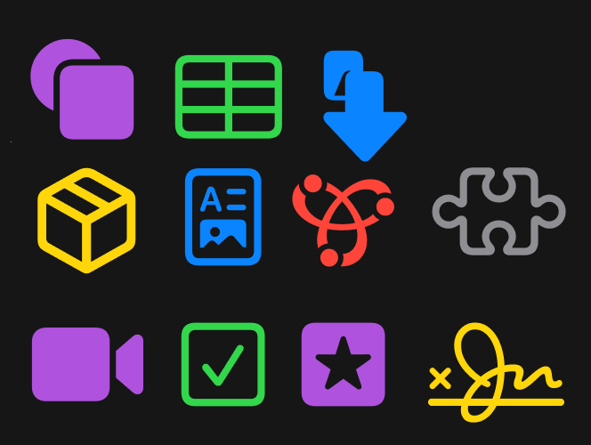

# Xcode like theme for VS Code

Make your VS Code cleaner and more beautiful.


## File Icons



## Folder Icons


## Inspiration

* [SF Symbols Icon Theme](https://marketplace.visualstudio.com/items?itemName=j-f1.sf-symbols)
* [macOS Modern Theme](https://marketplace.visualstudio.com/items?itemName=davidbwaters.macos-modern-theme)

## Extra Tweaks

Copy & paste this into `setting.json`.

```json
{
    "window.title": "${dirty}${activeEditorShort}",
    "breadcrumbs.enabled": true,
    "files.autoSave": "afterDelay",
    "editor.autoClosingBrackets": "always",
    "editor.minimap.enabled": true,

    "editor.fontFamily": "SF Mono",
}
```

And [extra extensions](extra-tweaks.md) for more Xcode a like feeling.

---

## And

* [Credits](credits.md)
* [Change Log](CHANGELOG.md)
* [Legal Disclaimer](Legel_Disclaimer.txt)
* [Extra Tweaks](extra-tweaks.md)

---

* [Marketplace (download)](https://github.com/Hetp05/xcode-theme-for-vscode/releases/download/extension/xcode-theme-for-vscode-1.0.2.vsix)
* [Repository (Github)](https://github.com/Hetp05/xcode-theme-for-vscode.git)
* [Het (creator)](https://github.com/Hetp05)

---

## Change Log

### `1.1.5`

* Updated some `.json` files, unordered to ordered A-Z list

* Updated screenshots' background

* Fixed "First Screenshot" bug on `README.md`

* Added file icon for `.mcpack` and `.mcaddon`

```txt
assets
    ┣ Screenshot-5.png
    ┗ Screenshot-8.png
themes
    ┗ icons
        ┗ minecraft.svg
    ┣ color-theme.json
    ┗ file-icons-theme.json
README.md
```

### `1.1.4`

* Added file called `screenshot-9`

* Updated comments color `#6A9955` to `#73A74E`

* Added four more file icons for `favicon.png`, `LICENSE`, `.mp4` and `todo`

* Updated an image in `credits.md`

* Added bunch of new keywords to `package.json`

```txt
assets
    ┗ Screenshot-9.png
themes
    ┗ icons
        ┣ favicon.svg
        ┣ license.svg
        ┣ mp4.svg
        ┗ todo.svg
    ┣ color-theme.json
    ┗ file-icons-theme.json
credits.md
package.json
```

---

**Enjoy Kinder Joy!** #not_sponsored
