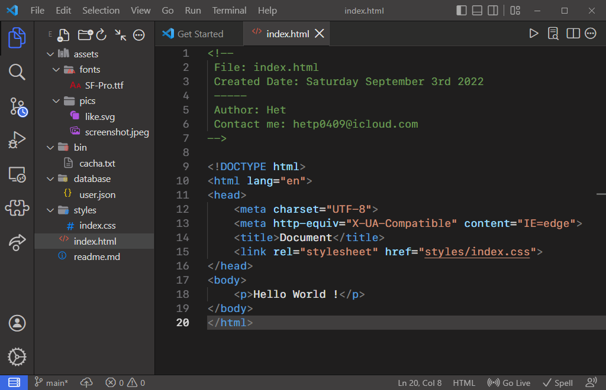

# Xcode like theme for VS Code

Make your VS Code cleaner and more beautiful.



## File Icons


## Folder Icons


## To Install the Theme

1. Download [`.vsix` file](https://github.com/Hetp05/xcode-theme-for-vscode/releases) from Github

2. Run the command

`code --install-extension xcode-theme-for-vscode-1.5.0.vsix`

[Learn More](https://code.visualstudio.com/docs/editor/extension-marketplace#_install-from-a-vsix)...

Or

1. Download [`.vsix` file](https://github.com/Hetp05/xcode-theme-for-vscode/releases) from Github

2. Open it in VS Code

3. Left click on it

4. To apply theme click on `Install Extension VSIX`

## Inspiration

* [SF Symbols Icon Theme](https://marketplace.visualstudio.com/items?itemName=j-f1.sf-symbols)
* [macOS Modern Theme](https://marketplace.visualstudio.com/items?itemName=davidbwaters.macos-modern-theme)

## Extra Tweaks

Copy & paste this into `setting.json`.

```json
{
    "window.title": "${dirty}${activeEditorShort}",
    "breadcrumbs.enabled": true,
    "files.autoSave": "afterDelay",
    "editor.autoClosingBrackets": "always",
    "editor.minimap.enabled": true,

    "editor.fontFamily": "SF Mono",
}
```

And [extra extensions](extra-tweaks.md) for more Xcode a like feeling.

---

## And

* [Contributing Guide](CONTRIBUTING.md)
* [Change Log](CHANGELOG.md)
* [Credits](credits.md)
* [Extra Tweaks](extra-tweaks.md)
* [Legal Disclaimer](Legel_Disclaimer.txt)

---

* [Marketplace (download)](https://github.com/Hetp05/xcode-theme-for-vscode/releases/download/extension/xcode-theme-for-vscode-1.0.2.vsix)
* [Repository (Github)](https://github.com/Hetp05/xcode-theme-for-vscode.git)
* [Het (creator)](https://github.com/Hetp05)

---

## Change Log

### `1.2.0`

* Update `account` icon in Production theme

* Added bunch of new file and folder icon

* Added contributing guide

* Improved icon alignment

* much more too long to write down :)

### `1.1.5`

* Updated some `.json` files, unordered to ordered A-Z list

* Updated screenshots' background

* Fixed "First Screenshot" bug on `README.md`

* Added file icon for `.mcpack` and `.mcaddon`

```txt
assets
    ┣ Screenshot-5.png
    ┗ Screenshot-8.png
themes
    ┗ icons
        ┗ minecraft.svg
    ┣ color-theme.json
    ┗ file-icons-theme.json
README.md
```

---

**Enjoy Kinder Joy!** #not_sponsored
