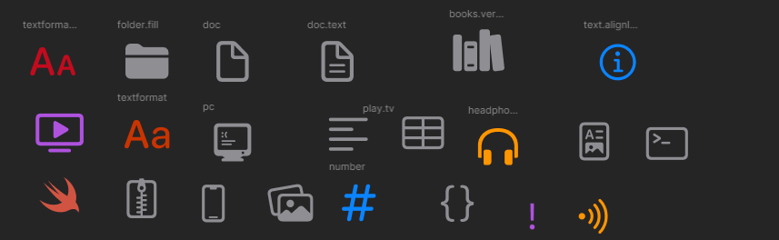

# The Xcode like theme for VS Code

Make your vs code cleaner and more beautiful.


## File Icons



## Folder Icons


## Inspiration

* [SF Symbols Icon Theme](https://marketplace.visualstudio.com/items?itemName=j-f1.sf-symbols)
* [macOS Modern Theme](https://marketplace.visualstudio.com/items?itemName=davidbwaters.macos-modern-theme)

## Extra Tweaks

Copy & paste this into `setting.json`.

```json
{
    "window.title": "${dirty}${activeEditorShort}",
    "breadcrumbs.enabled": true,
    "files.autoSave": "afterDelay",
    "editor.autoClosingBrackets": "always",
    "editor.minimap.enabled": true,

    "editor.fontFamily": "SF Mono",
}
```

And extra extensions for more Xcode a like feeling.

[psioniq File Header](https://marketplace.visualstudio.com/items?itemName=psioniq.psi-header)

![Header extension preview]

Also, copy & paste this into `setting.json`.

```json
{
    "psi-header.config": {
        "forceToTop": true,
        "spacesBetweenYears": false,
        "blankLinesAfter": 1,
        "author": "Your name",
        "authorEmail": " example@icloud.com",
        "creationDateZero": "asIs",
        "license": "license.txt"
    },
    "psi-header.lang-config": [
        {
            "language": "Swift",
            "begin": "// ",
            "prefix": "// ",
            "end": "// ",
            "modDateFormat": "dd/MM/yyyy",
        }
    ],
    "psi-header.templates": [
        {
            "language": "Swift",
            "template": [
                "<<Filename>>",
                "<<Projectname>>",
                "     ",
                "Create by <<author>> on dd/MM/yyyy.",
                "Copyright (c) <<year>> <<author>>. All rights reserved."
            ],
        },
    ]
}
```

Also, copy & paste this into `setting.json`.

[Vibrancy](https://marketplace.visualstudio.com/items?itemName=eyhn.vscode-vibrancy)


```json
{
    "vscode_vibrancy.theme": "Dark (Only Subbar)",
}
```

## And

* [Credits](credits.md)
* [Change Log](CHANGELOG.md)
* [Legal Disclaimer](Legel_Disclaimer.txt)

---

## Change Log

### `1.1.1`


* Added file icon for `Legal_disclaimer`

### `1.1.0`

* Updated `package.json`, `credits.md` and `CHANGLOG.md`

* Added `Legel_Disclaimer.txt`

```txt
* folder
    ┣ CHANGELOG.md
    ┣ credits.md
    ┣ Legel_Disclaimer.txt
    ┗ README.md
```

---

**Enjoy Kinder Joy!** #not_sponsored
