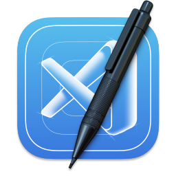
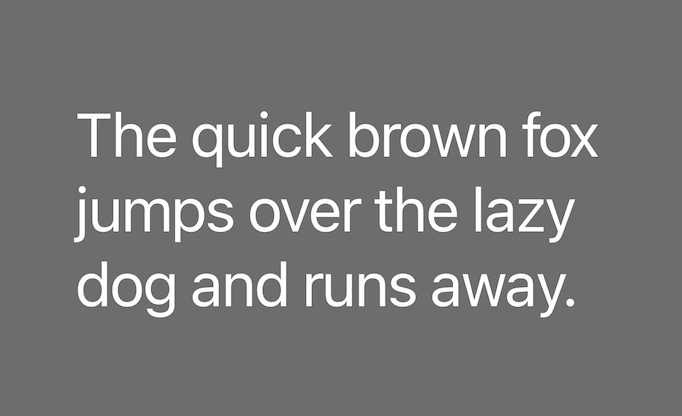
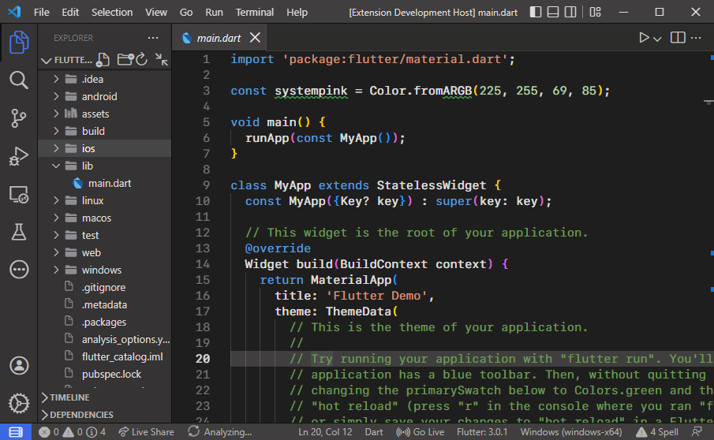

# Credits/ Inspiration for this Theme

> Work smarter not harder.

---

## Icon

Created by [Anmol Govinda Rao](https://macosicons.com/#/u/Anmol%20Govinda%20Rao).



From [macosicons.com](https://macosicons.com).

---

## Font

```txt
themes
    ┗ fonts
        ┗ SF-Pro-Display-Light.otf
```

"[SF Pro Display Light](https://developers.apple.com/fonts/)" font by Apple.



Copyright © 2022 Apple Inc. All rights reserved.

---

## Color/ File Icon Theme

```txt
themes
    ┣ color-theme.json
    ┗ file-icons-theme.json
```

[macOS Modern Theme](https://marketplace.visualstudio.com/items?itemName=davidbwaters.macos-modern-theme) VS Code extension by [davidbwaters](https://marketplace.visualstudio.com/publishers/davidbwaters)

Originally symbols created by [Apple](https://developer.apple.com/sf-symbols/).


---

## Product Theme

```txt
themes
    ┗ product-theme.json
```

VS Code extension ["SF Symbols Icon Theme"](https://marketplace.visualstudio.com/items?itemName=j-f1.sf-symbols).


---

## This Theme [Creator](https://hetp05.github.io/hetp/)

```txt
package.json
```


